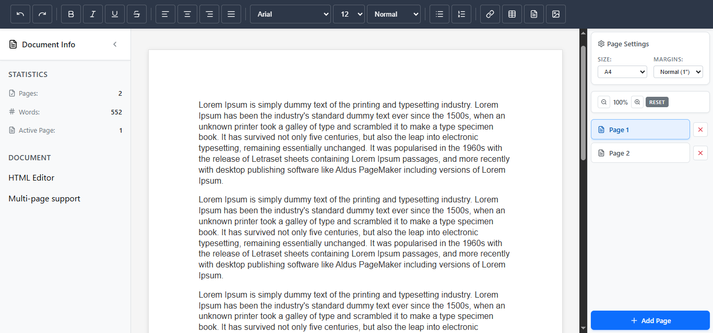

# @prabhath-tharaka/html-editor

[](https://badge.fury.io/js/%40prabhath-tharaka%2Fhtml-editor)
[](https://opensource.org/licenses/MIT)
[](https://github.com/Prabhath-Tharaka/htmleditor/issues)
[](https://github.com/Prabhath-Tharaka/htmleditor/stargazers)

A React-based WYSIWYG HTML editor with automatic page reflow, rich text formatting, and multi-page document management. Perfect for creating documents, reports, and rich content editors.



## ✨ Features

- **WYSIWYG Editing**: Real-time HTML content editing with rich text formatting
- **Automatic Page Reflow**: Content automatically flows across pages with intelligent page break insertion
- **Multi-Page Management**: Navigate, add, delete, and manage pages seamlessly
- **Rich Text Formatting**: Bold, italic, underline, strikethrough, alignment, fonts, and more
- **Page Size Support**: A4, Letter, and Legal page formats
- **Customizable UI**: Show/hide sidebar, toolbar, and page manager components
- **Performance Optimized**: Efficient reflow algorithms and debounced operations
- **TypeScript Ready**: Full type definitions included
- **Responsive Design**: Works across desktop and mobile devices
- **Advanced Content Support**: Comprehensive HTML content normalization for tables, lists, images, headings, and complex structures
- **Page Break Management**: Visual page break removal with automatic content reflow

## 📦 Installation

```bash
# Install the editor library
npm install @prabhath-tharaka/html-editor

# Install peer dependencies (if not already installed)
npm install react react-dom
```

## 🚀 Quick Start

```jsx
import React from 'react';
import { HtmlEditor, DocumentProvider } from '@prabhath-tharaka/html-editor';
import '@prabhath-tharaka/html-editor/styles';

function App() {
  return (
    <DocumentProvider>
      <HtmlEditor />
    </DocumentProvider>
  );
}

export default App;
```

## 🎯 Basic Usage

### With Ref Access

```jsx
import React, { useRef } from 'react';

function App() {
  const editorRef = useRef(null);

  const handleSave = () => {
    const htmlContent = editorRef.current.getHTMLContent();
    const plainText = editorRef.current.getPlainText();
    console.log('HTML:', htmlContent);
    console.log('Text:', plainText);
  };

  const handleInsertContent = () => {
    // Insert content at cursor position without replacing existing content
    editorRef.current.insertContent('<p><strong>New content inserted!</strong></p>');
  };

  const handleSetContent = () => {
    const sampleContent = '<h1>Sample Document</h1><p>This is sample content.</p>';
    editorRef.current.setContent(sampleContent);
  };

  return (
    <div>
      <DocumentProvider>
        <HtmlEditor ref={editorRef} />
      </DocumentProvider>
      <button onClick={handleSave}>Save Content</button>
      <button onClick={handleInsertContent}>Insert Content</button>
      <button onClick={handleSetContent}>Set Sample Content</button>
    </div>
  );
}
```

### Custom Configuration

```jsx
function App() {
  return (
    <DocumentProvider initialState={{ title: "My Document", pageSize: "A4" }}>
      <HtmlEditor 
        showSidebar={true}
        showToolbar={true}
        showPageManager={true}
        onNavigatePage={(pageIndex) => console.log('Page:', pageIndex)}
        onAddPage={() => console.log('Page added')}
        onChange={(html) => console.log('Content changed')}
      />
    </DocumentProvider>
  );
}
```

## 🔧 API Reference

### HtmlEditor

The main editor component with ref access to content methods.

**Props:**
- `pageManagerComponent?: ReactNode` - Custom page manager component
- `onNavigatePage?: (pageIndex: number) => void` - Page navigation callback
- `onAddPage?: () => void` - Page addition callback
- `onDeletePage?: (pageIndex: number) => void` - Page deletion callback
- `onPageSizeChange?: (size: 'A4' | 'Letter' | 'Legal') => void` - Page size change callback
- `onChange?: (htmlContent: string) => void` - Content change callback
- `showSidebar?: boolean` - Show/hide sidebar (default: true)
- `showToolbar?: boolean` - Show/hide toolbar (default: true)
- `showPageManager?: boolean` - Show/hide page manager (default: true)

**Ref Methods:**
- `getHTMLContent(): string` - Returns current HTML content
- `getPlainText(): string` - Returns plain text content
- `setContent(html: string): void` - Set editor content programmatically
- `insertContent(html: string): void` - Insert content at cursor position without replacing existing content

### DocumentProvider

Context provider for document state management.

```jsx
<DocumentProvider initialState={{ title: "Document", pageSize: "A4" }}>
  <HtmlEditor />
</DocumentProvider>
```

## 📖 Documentation

For complete documentation, check out our [Wiki](https://github.com/Prabhath-Tharaka/htmleditor/wiki) which includes:

- [Getting Started](https://github.com/Prabhath-Tharaka/htmleditor/wiki/01-Getting-Started)
- [API Reference](https://github.com/Prabhath-Tharaka/htmleditor/wiki/02-API-Reference)
- [Advanced Usage](https://github.com/Prabhath-Tharaka/htmleditor/wiki/03-Advanced-Usage)
- [Architecture](https://github.com/Prabhath-Tharaka/htmleditor/wiki/04-Architecture)
- [Troubleshooting](https://github.com/Prabhath-Tharaka/htmleditor/wiki/05-Troubleshooting)

## 🎨 Styling

Import default styles:

```jsx
import '@prabhath-tharaka/html-editor/styles';
```

Or use your own CSS:

```css
.multi-page-editor {
  border: 1px solid #e0e0e0;
  border-radius: 8px;
}

.editor-toolbar {
  background: #f8f9fa;
  border-bottom: 1px solid #e0e0e0;
}
```

## 🔍 Examples

### Custom Page Manager

```jsx
import { useDocumentActions, useDocumentState } from '@prabhath-tharaka/html-editor';

function CustomPageManager() {
  const { pages, activePage } = useDocumentState();
  const { setActivePage, addPage } = useDocumentActions();

  return (
    <div className="custom-pager">
      <button onClick={addPage}>+ Add Page</button>
      {pages.map((_, index) => (
        <button 
          key={index}
          onClick={() => setActivePage(index)}
          className={index === activePage ? 'active' : ''}
        >
          Page {index + 1}
        </button>
      ))}
    </div>
  );
}

// Usage
<HtmlEditor pageManagerComponent={<CustomPageManager />} />
```

### Programmatic Content Control

```jsx
function TemplateLoader() {
  const editorRef = useRef(null);

  const loadTemplate = (template) => {
    editorRef.current.setContent(template);
  };

  const insertSignature = () => {
    editorRef.current.insertContent('<p><em>-- Document Signature</em></p>');
  };

  return (
    <div>
      <DocumentProvider>
        <HtmlEditor ref={editorRef} />
      </DocumentProvider>
      <button onClick={() => loadTemplate('<h1>Template</h1><p>Content</p>')}>
        Load Template
      </button>
      <button onClick={insertSignature}>
        Insert Signature
      </button>
    </div>
  );
}
```

## 🧪 Testing

The library includes comprehensive tests:

```bash
# Run unit tests
npm test

# Run end-to-end tests
npm run test:e2e

# Run tests with coverage
npm run test:coverage
```

## 🤝 Contributing

We welcome contributions! Please see our [Contributing Guide](CONTRIBUTING.md) for details.

1. Fork the repository
2. Create a feature branch
3. Make your changes
4. Add tests
5. Submit a pull request

## 🐛 Reporting Issues

Found a bug? Please [create an issue](https://github.com/Prabhath-Tharaka/htmleditor/issues) with:

- Steps to reproduce
- Expected vs actual behavior
- Browser and environment information

## 💡 Feature Requests

Have an idea for improvement? [Suggest a feature](https://github.com/Prabhath-Tharaka/htmleditor/issues) with:

- Use case description
- Proposed implementation
- Value it would provide

## 📄 License

MIT License - see [LICENSE](LICENSE) file for details.

## 🔗 Links

- **GitHub**: https://github.com/Prabhath-Tharaka/htmleditor
- **npm**: https://www.npmjs.com/package/@prabhath-tharaka/html-editor
- **Issues**: https://github.com/Prabhath-Tharaka/htmleditor/issues
- **Discussions**: https://github.com/Prabhath-Tharaka/htmleditor/discussions

## 📋 Changelog

See [CHANGELOG.md](CHANGELOG.md) for a detailed list of changes.

---

**Made with ❤️ by Prabhath Tharaka**

If you find this library useful, please consider giving it a star on GitHub! ⭐